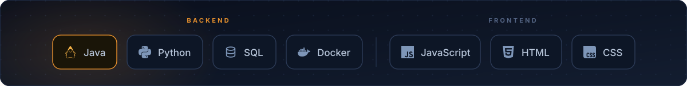

  

  
  &nbsp;&nbsp;
  

---

## About

Greek software engineer living in Bulgaria, working on the backend. I write mostly Java, spend a lot of time in SQL, and care about code that still makes sense six months after I wrote it.

Right now I'm building a full-stack appointment booking platform for psychology practices — scheduling logic, availability rules, and the client-facing flow on top. Real users and real edge cases have taught me more than any tutorial.

- **Focus** — backend development with Java, SQL and Docker
- **Building** — a booking platform for psychology practices
- **Learning** — operating systems, networking, algorithm design and analysis
- **Open to** — junior backend roles, remote or on-site in Bulgaria
- **Reach me** — [xelidonialex@gmail.com](mailto:xelidonialex@gmail.com)

---

## Tech Stack

  

---

## Projects

| Project | What it does | Stack |
| :--- | :--- | :--- |
| **[Psychology Booking Platform](https://github.com/AlexChelidonis/REPO-NAME)** | Appointment system for psychology practices. Practitioners publish their availability, clients book against it, and the scheduler enforces the rules so two people can't claim the same slot. | `Java` `SQL` `JavaScript` |
| **[Face Recognition App](https://github.com/AlexChelidonis/Face-Recognition-App-with-Python-)** | Recognises known faces from a webcam feed and enrolls unknown ones on the spot — captures 20 grayscale samples per new subject and retrains without restarting. | `Python` |
| **[Java Calculator](https://github.com/AlexChelidonis/Culculator-using-Java)** | Desktop calculator built on a small expression evaluator behind a Swing interface. | `Java` |

<!--
  ADD A PROJECT: copy this row into the table above and fill in the four fields.
  Lead with what it does for a user, not what it's built with — the Stack column covers that.
  If a project is deployed, put the demo link right in the description:  ([live demo](https://...))

| **[Project Name](https://github.com/AlexChelidonis/repo-name)** | One sentence on what it does. | `Java` `Docker` |
-->

---

## Contributions

<!--
  Generated by the GitHub Action in .github/workflows/snake.yml and published to
  the "output" branch of this repo. If you haven't added that workflow, this image
  will be broken — add it, or delete this section down to the next divider.
-->

  <picture>
    <source media="(prefers-color-scheme: dark)" srcset="https://raw.githubusercontent.com/AlexChelidonis/AlexChelidonis/output/github-snake-dark.svg" />
    <source media="(prefers-color-scheme: light)" srcset="https://raw.githubusercontent.com/AlexChelidonis/AlexChelidonis/output/github-snake.svg" />
    
  </picture>

<!--
  STATS CARDS — currently disabled.

  These break constantly on the shared public instance. Once you've deployed your
  own copy of github-readme-stats to Vercel, replace YOUR-VERCEL-APP below with
  your deployment's subdomain and delete the two comment markers around this block.

  
  

-->

---

  Open to interesting backend problems and good conversations. 
  <a href="mailto:xelidonialex@gmail.com">xelidonialex@gmail.com</a>

